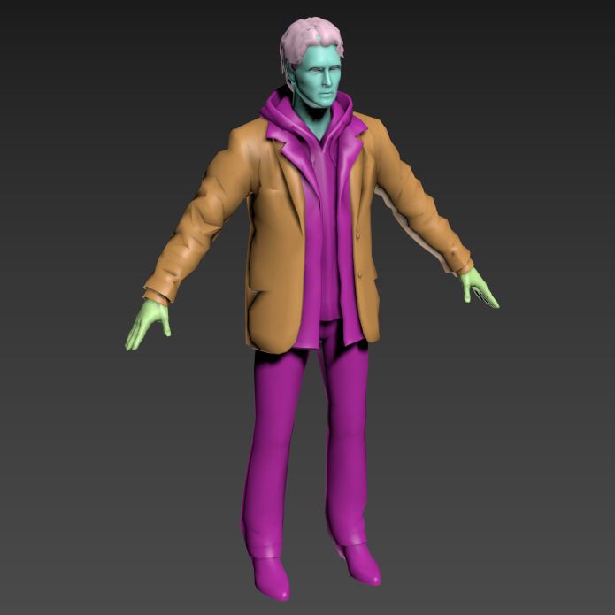

# mxs_alan_wake_pc



**imp_binmsh.ms** is a 3ds Max MaxScript tool developed to import model assets from the game **Alan Wake**. This script allows users to bring BINMSH files into 3ds Max, facilitating the visualization and editing of game models within the 3D modeling environment.

## Deprecation Notice

Please note that **mxs_alan_wake_pc** is deprecated and has been superseded by **Volfin's Northlight Tool**, which is designed for Blender. Volfin's tool offers enhanced functionality, stability, and ongoing support for importing Alan Wake assets, making it the preferred choice for users seeking comprehensive features.

## Table of Contents

- [Features](#features)
- [Installation](#installation)
- [Usage](#usage)
- [Limitations](#limitations)
- [Acknowledgements](#acknowledgements)

## Features

- **Import BINMSH Files**: Load and import BINMSH model files from Alan Wake into 3ds Max.
- **Clear Scene Option**: Option to clear the current scene before importing a new model.
- **Skinning Support**: Enable or disable skinning during the import process.
- **Mesh Flipping**: Option to flip the X-axis of the imported mesh.
- **Multi-Material Support**: Handles multiple materials per model, applying them correctly based on the model's LOD (Level of Detail).
- **Breakable Meshes**: (Experimental) Support for importing breakable meshes as defined in the game files.

## Installation

1. **Prerequisites**:
   - **3ds Max**: Ensure you have 3ds Max installed on your PC.
   - **MaxScript**: This script is written in MaxScript and requires no additional plugins.

2. **Download the Script**:
   - Clone the repository or download the `mxs_alan_wake_pc.ms` file directly from GitHub.

   ```bash
   git clone https://github.com/coreynguyen/mxs_alan_wake_pc.git
   ```

3. **Install the Script**:
   - Place the `mxs_alan_wake_pc.ms` file in your 3ds Max scripts directory, typically found at:
     ```
     C:\Program Files\Autodeskds Max [Version]\Scripts     ```

4. **Load the Script in 3ds Max**:
   - Open 3ds Max.
   - Go to **Scripting > Run Script**.
   - Navigate to the `imp_binmsh.ms` file and open it.
   - A dialog window titled "Alan Wake" will appear.

## Usage

1. **Open the Import Dialog**:
   - Run the script as described in the Installation section.
   - The "Alan Wake" dialog window will appear.

2. **Import a BINMSH File**:
   - Click the **"Import BINMSH"** button.
   - Select the desired `.binmsh` file from your Alan Wake assets.

3. **Configure Import Options**:
   - **Clear Scene**: Check this option to clear the current scene before importing the new model.
   - **Enable Skin**: Check this to apply skinning to the imported model (if bone data is available).
   - **Flip X Axis of Mesh**: Check to flip the mesh along the X-axis, which may be necessary for proper orientation.

4. **Finalize Import**:
   - After selecting the file and configuring options, click **"Import BINMSH"**.
   - A confirmation message "Done!" will appear upon successful import.

## Limitations

- **Stability**: The script is tailored to work with the provided sample BINMSH files. It may not function correctly with other files due to the dynamic nature of the Alan Wake model format.
- **Bone Hierarchy**: The script currently lacks full support for bone hierarchies, making skinning less reliable.
- **Material Handling**: While multi-material support is implemented, inconsistencies in texture paths may require manual adjustments.
- **No Animation Support**: Animations are not supported in this version.
- **Debugging**: Some debugging options are available, but comprehensive error handling is limited.

## Acknowledgements

- **Volfin**: For developing the Northlight Tool and contributing valuable insights into the Alan Wake asset formats.
- **Xentax Forums**: For community support and resources on game asset extraction.

---

**Note**: This script is provided "as-is" without any warranties. Use it responsibly and ensure you have the rights to the assets you are importing.
